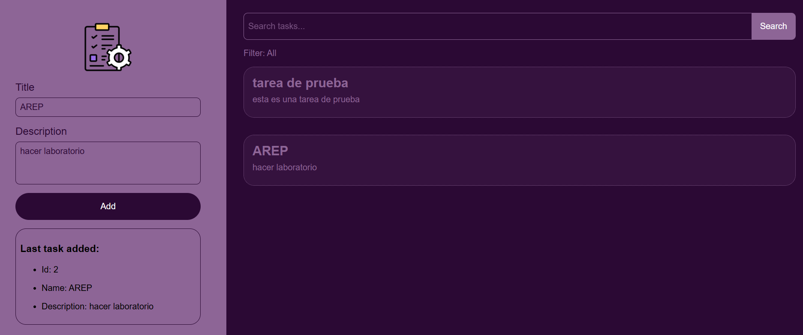

# Taller diseño y estructuración de aplicaciones distribuidas en internet

## Introducción

En este taller se trabajará en el diseño y la implementación de la arquitectura de aplicaciones distribuidas, 
enfocándose en los servidores web y el protocolo HTTP.
Se desarrollará una aplicación de gestión de tareas que permitirá agregar y buscar tareas. Para ello:

* Se implementará un Servidor Web en Java, con soporte para manejar múltiples solicitudes de forma no concurrente.

* El servidor será responsable de servir los archivos estáticos almacenados en disco, necesarios para cargar correctamente
la aplicación.

* Se incluirá la comunicación asíncrona mediante los métodos HTTP `GET` y `POST` donde el metodo **GET** se encarga de
devolver la lista de tareas basado en el filtro de busqueda y el método **POST** permite crear una nueva tarea y retornar
la nueva información de la tarea generada.

De esta manera, se introduce los fundamentos del funcionamiento de un servidor web, la manipulación de 
solicitudes HTTP y la integración entre cliente y servidor. 

## Arquitectura
La siguiente figura muestra el **diagrama de clases** que representa la estructura interna del servidor web.  
En él se ilustran los componentes principales, sus responsabilidades y las relaciones entre ellos.


## Primeros Pasos

### Prerrequisitos

Antes de comenzar, es necesario tener instalado lo siguiente en el entorno:

* **Java Development Kit (JDK) 21 o superior**

  [Descargar JDK](https://www.oracle.com/java/technologies/javase/jdk21-archive-downloads.html)

  Verifica la versión

    ```
    java -version
    ```
* **Maven**

  Construcción de gestión de dependencias -
  [Instalar Maven](https://maven.apache.org/download.cgi)

  Verifica la instalación 

    ```
    mvn -version
    ```

* **Git**

  Control de versiones -
  [Descargar Git](https://git-scm.com/downloads)

  Verifica la instalación

    ```
    git -version
    ```

### Instalación

1. Clonar el repositorio
    ```
    git clone https://github.com/CamilaTorres08/Taller1_AREP.git
    cd Taller1_AREP
    ```
2. Compilar el proyecto
    ```
    mvn clean install
    ```
3. Ejecutar el servidor
    ```
    mvn exec:java
    ```
   O directamente en la IDE dando click en *Run* sobre el archivo

   `Taller1ArepApplication`

4. Abrir la aplicación en el navegador
    ```
    http://localhost:35000
    ```

## Funcionamiento

Al iniciar la aplicación, el servidor abre un **socket** en el puerto `35000` y queda a la espera de recibir solicitudes entrantes.  
Cuando el usuario accede desde un navegador, se envía una petición **HTTP GET** solicitando el recurso `index.html`.  
El propio navegador se encarga de realizar las solicitudes adicionales necesarias para cargar las hojas de estilo (CSS) y los scripts de JavaScript definidos en dicho archivo.  
Todos los recursos estáticos se encuentran almacenados en el directorio `src/main/resources`.


### Metodos asincronicos

#### **POST**

Para agregar una nueva tarea, el usuario completa el formulario ubicado en el panel izquierdo de la aplicación y hace clic en el botón **Add**.  
El cliente realiza una petición **HTTP POST** al recurso: `http:/localhost:35000/app/tasks` y en el cuerpo del mensaje,
se envía un JSON con el nombre y descripción de la tarea, la siguiente imagen es un ejemplo de cuando se crea la tarea:


El servidor procesa la información, crea la nueva tarea y responde con el objeto JSON de la tarea creada, el encabezado
`Content-Type: application/json` y el código de respuesta `200 OK`. Finalmente, la información de la nueva tarea es mostrada
en la aplicación. 

#### **GET**

Para consultar tareas por nombre, el usuario utiliza la barra de búsqueda y hace clic en el botón **Search**.  
El cliente realiza una petición **HTTP GET** al recurso: `http://localhost:35000/app/tasks?name="+value` 
Donde `<value>` corresponde al texto ingresado en la búsqueda.  
El servidor procesa el parámetro, filtra las tareas cuyo nombre contenga ese valor y devuelve la lista de tareas junto 
con el encabezado `Content-Type: application/json` y el codigo de respuesta `200 OK`.

Ejemplo consultando las tareas con nombre **“AREP”**:


Para obtener **todas las tareas**, basta con limpiar el campo de búsqueda y volver a dar click en el botón de busqueda:      


#### **Codigos de Respuesta**

El servidor implementa diferentes códigos de estado HTTP según la acción realizada:

* **200 OK**: El recurso se ejecutó correctamente.
* **404 Not Found**: El archivo solicitado no existe.
* **405 Method Not Allowed**: El método HTTP utilizado no está permitido para el recurso.
* **400 Bad Request**: El cuerpo o parámetros enviados son inválidos o están incompletos.
* **500 Internal Server Error**: Se produjo una excepción no controlada en el servidor.

Ejemplo de una petición a un recurso inexistente en disco:

Ejemplo de una petición utilizando un método no soportado:  


## Pruebas

Este taller incluye pruebas automatizadas usando JUnit para validar el funcionamiento del servidor web.
El archivo de pruebas se encuentra en: 

`src\test\java\edu\eci\arep\webserver\taller1_arep\HttpServerTests.java`

### Ejecución de pruebas

* **Usando Maven**

    Ejecute todas las pruebas con el siguiente comando:
    ```
    mvn test
    ```
* **Usando la IDE**
    
    Abra el archivo `HttpServerTests` y ejecute directamente las pruebas con el botón *Run Test*

Estas pruebas se encargan de levantar el servidor en el puerto 35001 utilizando hilos para iniciarlo y finalizarlo automáticamente al terminar la ejecución.
El objetivo principal es validar que los archivos esten retornando correctamente,
las tareas puedan consultarse y crearse mediante los métodos GET y POST y lograr que el servidor maneje adecuadamente los códigos de error HTTP en distintos escenarios.

De esta manera, se asegura el correcto funcionamiento del servidor, abarcando tanto los casos de uso comunes como los de error.


## Despliegue

Este proyecto está previsto para ejecutarse localmente con fines de desarrollo y pruebas.

## Tecnologías utilizadas

* [Java 21](https://openjdk.org/projects/jdk/21/) - Lenguaje de Programación
* [Maven](https://maven.apache.org/) - Compilaciones y dependencias
* [JUnit](https://junit.org/) - Framework de testeo

## Versionamiento

Actualmente se encuentra en desarrollo y se usa la versión por defecto `0.0.1-SNAPSHOT`.

## Autores

* **Andrea Camila Torres González** 

## Licencia

Este proyecto no cuenta actualmente con una licencia específica.  
Su uso está restringido únicamente a fines académicos.


